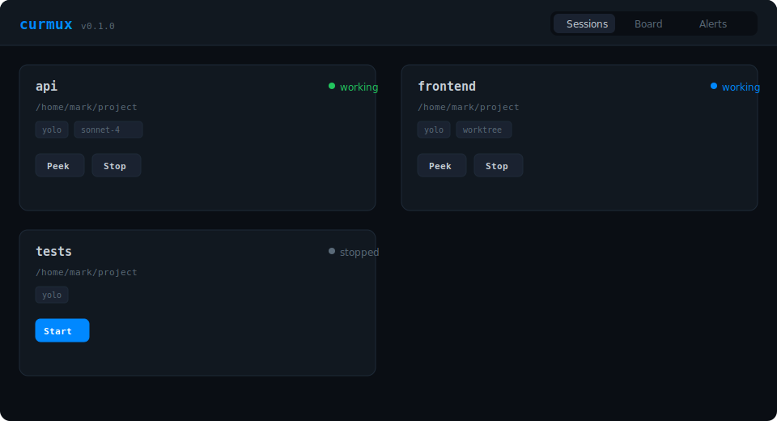
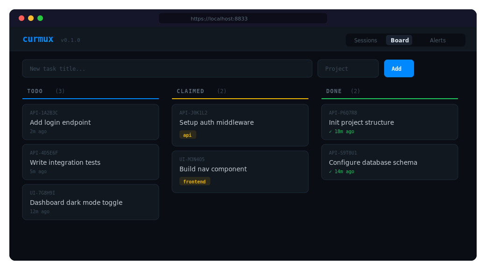
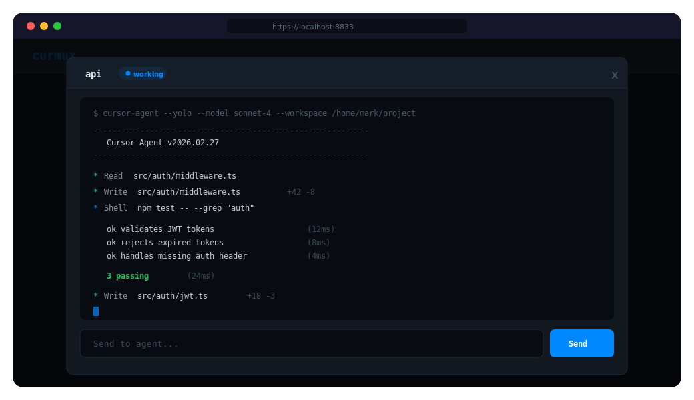

# curmux — Cursor Agent Multiplexer

Run parallel `cursor-agent` TUI sessions with a self-healing watchdog, shared task board, and web dashboard. Single file. No external dependencies beyond Python 3 + tmux.

```bash
git clone https://github.com/mamercad/curmux && cd curmux && ./install.sh
curmux register myproject --dir ~/myproject --yolo
curmux start myproject
curmux serve   # → https://localhost:8833
```

---

## Why curmux?

| Problem | curmux's solution |
|---------|-------------------|
| Can't run multiple cursor agents at once | **tmux-backed sessions** — each agent in its own pane |
| Agent crashes or exits mid-task | **Self-healing watchdog** — auto-restarts with `cursor-agent --continue` |
| Agents duplicate work | **Task board** — SQLite-backed atomic claiming |
| No visibility across sessions | **Web dashboard** — live status, peek, send |
| Agents can't coordinate | **REST API** — shared memory, messaging, task delegation |

---

## Dashboard

### Sessions

Live status cards for every registered agent. Start, stop, and peek from the browser.



### Task Board

SQLite-backed kanban with atomic task claiming. Agents claim work via the REST API; no duplicated effort.



### Peek

Full terminal output with a send bar — monitor and direct agents without attaching to tmux.



---

## Example: Parallel Feature Development

Spin up two agents — one for the API, one for the frontend — with a shared task board so they don't step on each other.

```bash
# Register agents pointed at the same repo, isolated by worktree
curmux register api      --dir ~/myapp --yolo --model sonnet-4
curmux register frontend --dir ~/myapp --yolo --model sonnet-4 --worktree

# Seed the task board
curmux board add --title "Build POST /auth/login endpoint"   --project API
curmux board add --title "Build POST /auth/register endpoint" --project API
curmux board add --title "Create login page component"       --project UI
curmux board add --title "Create signup page component"      --project UI

# Launch both agents
curmux start api
curmux start frontend

# Open the dashboard to watch them work
curmux serve
```

From the dashboard (or CLI), each agent claims tasks atomically — no duplicated work. Peek into either session live, send follow-up prompts, and let the watchdog handle crashes.

```bash
# Check on progress
curmux peek api
curmux peek frontend

# Send a directive to the api agent
curmux send api "use bcrypt for password hashing, not argon2"

# See what's been claimed
curmux board list   # or: curmux board ls
```

---

## Features

- **Parallel agents** — register and run many `cursor-agent` sessions, each in tmux
- **Watchdog** — detects exited/stuck agents, auto-restarts in yolo mode, auto-accepts confirmations
- **Task board** — SQLite-backed kanban with atomic task claiming (CAS)
- **Web dashboard** — session cards, live peek, send bar, task board, alerts
- **REST API** — full CRUD for sessions, tasks, memory, messages
- **Worktree isolation** — `--worktree` flag for per-agent branch isolation
- **Prefix matching** — `curmux attach my` resolves to `myproject`
- **Zero external deps** — Python 3 stdlib only (sqlite3, http.server, ssl, threading)
- **Single file** — one executable, edit it, extend it

## Requirements

- Python 3.8+
- tmux (uses your existing `~/.tmux.conf` if present)
- [Cursor Agent CLI](https://cursor.sh) (`cursor-agent`)

## Install

```bash
git clone https://github.com/mamercad/curmux && cd curmux && ./install.sh
```

Or directly:

```bash
curl -fsSL https://raw.githubusercontent.com/mamercad/curmux/main/curmux -o /usr/local/bin/curmux
chmod +x /usr/local/bin/curmux
```

## Quick Start

```bash
# Register agents pointing at a git repo
curmux register api --dir ~/myproject --yolo --model sonnet-4
curmux register frontend --dir ~/myproject --yolo --worktree

# Launch them
curmux start api
curmux start frontend

# Attach to a session's TUI
curmux attach api

# Or monitor everything from the browser
curmux serve   # → https://localhost:8833
```

**Shell completion (optional)** — tab-complete subcommands, session names, and task IDs:

```bash
# Bash: current session only
source <(curmux completion bash)

# Zsh: current session only
source <(curmux completion zsh)
```

To install permanently, see [Shell completion](#shell-completion) below.

## CLI

```bash
curmux register <name> --dir <path> [--yolo] [--model sonnet-4] [--worktree]
curmux update <name> [--dir <path>] [--yolo] [--no-yolo] [--model M] [--worktree] [--no-worktree]
curmux start <name>
curmux stop <name>
curmux rm <name>              # remove session (stops if running, cleans up DB)
curmux attach <name>          # attach to tmux session (detach: Ctrl-b d)
curmux peek <name>            # view output without attaching
curmux send <name> <text>     # send text to a session
curmux exec <name> --dir <path> [--yolo] -- <prompt>
curmux ls | list [--format json]   # list sessions
curmux board ls | list             # show task board
curmux board add --title "..." [--project PRJ]
curmux board claim TASK-ID --agent <name>
curmux board done TASK-ID
curmux serve [--port 8833]    # web dashboard + watchdog
curmux completion bash | zsh  # print shell completion script
```

Session names support prefix matching — `curmux peek my` resolves to `myproject` if unambiguous.

## Shell completion

Tab-complete subcommands (`start`, `board`, …), session names, and task IDs.

**Bash** (current session):

```bash
source <(curmux completion bash)
```

**Bash** (persistent): install the script and source it from `~/.bashrc`:

```bash
curmux completion bash > ~/.local/share/bash-completion/completions/curmux
# Then ensure your bashrc loads completions from that dir, e.g.:
# [ -d ~/.local/share/bash-completion/completions ] && for f in ~/.local/share/bash-completion/completions/*; do source "$f"; done
```

**Zsh** (current session):

```bash
source <(curmux completion zsh)
```

**Zsh** (persistent): add to `~/.zshrc` or put the script in a directory in `fpath` and run `compinit`:

```bash
curmux completion zsh > ~/.zsh/completions/_curmux
# In ~/.zshrc: fpath=(~/.zsh/completions $fpath) and compinit
```

## Watchdog

When `curmux serve` is running, the watchdog checks all sessions every 15 seconds:

| Condition | Action |
|-----------|--------|
| Agent exited to shell prompt (yolo mode) | Auto-restarts with `cursor-agent --continue` |
| Agent waiting for confirmation (yolo mode) | Auto-accepts after 30s |
| Agent idle for 10+ minutes | Pushes a `stuck` alert |

## REST API

All endpoints available at `https://localhost:8833/api/`.

### Sessions

```bash
# List sessions
curl -sk https://localhost:8833/api/sessions

# Peek at output
curl -sk https://localhost:8833/api/sessions/myproject/peek?lines=50

# Send text to a session
curl -sk -X POST -H 'Content-Type: application/json' \
  -d '{"text":"implement the auth endpoint"}' \
  https://localhost:8833/api/sessions/myproject/send

# Start / stop
curl -sk -X POST https://localhost:8833/api/sessions/myproject/start
curl -sk -X POST https://localhost:8833/api/sessions/myproject/stop
```

### Task Board

```bash
# Create a task
curl -sk -X POST -H 'Content-Type: application/json' \
  -d '{"title":"Add login endpoint","project":"API"}' \
  https://localhost:8833/api/tasks

# Claim a task (atomic — only one agent wins)
curl -sk -X POST -H 'Content-Type: application/json' \
  -d '{"agent":"api"}' \
  https://localhost:8833/api/tasks/API-A1B2C3/claim

# Complete a task
curl -sk -X POST https://localhost:8833/api/tasks/API-A1B2C3/done
```

### Shared Memory & Messaging

```bash
# Write shared context
curl -sk -X POST -H 'Content-Type: application/json' \
  -d '{"key":"db_schema","value":"users(id,email,hash)"}' \
  https://localhost:8833/api/memory

# Read shared context
curl -sk https://localhost:8833/api/memory?key=db_schema

# Send a message between agents
curl -sk -X POST -H 'Content-Type: application/json' \
  -d '{"sender":"api","recipient":"frontend","body":"auth schema changed"}' \
  https://localhost:8833/api/messages

# Read messages for an agent
curl -sk https://localhost:8833/api/messages?recipient=frontend
```

## Data

All state lives in `~/.curmux/`:

```
~/.curmux/
├── curmux.db     # SQLite WAL (sessions, tasks, messages, memory, alerts)
├── tls/          # Auto-generated TLS certs
└── logs/         # Session logs
```

## Acknowledgments

Heavily inspired by [amux](https://github.com/mixpeek/amux) — the original Claude Code multiplexer. curmux adapts the same patterns (tmux wrapping, self-healing watchdog, SQLite task board, single-file architecture) for the `cursor-agent` TUI. Props to the [Mixpeek](https://github.com/mixpeek) team for proving the pattern. 🙏

## License

MIT

---

<p align="center">
  Made with ❤️ and ☕ in the Great Lakes State of Michigan 🏔️🌊
</p>
